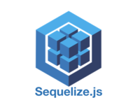
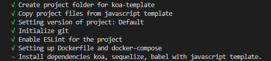
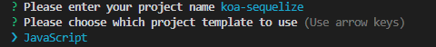
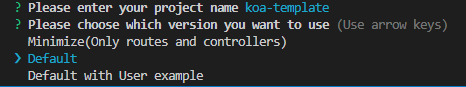
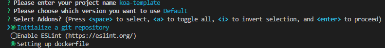
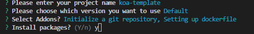
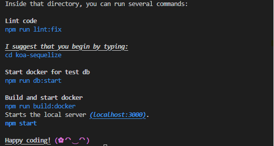

# koa-boilerplate-cli

  

koa-boilerplate-cli is a cli toolkit to generate boilerplate code using KoaJS + Sequelize ORM from template for quick web development.

* Using [KoaJs](https://koajs.com/) framework 
* Using [Sequeilze](https://sequelize.org/) ORM.
* Using [Babel](https://babeljs.io/) to compile code.
* Adding ESLint, Dockerfile feature.
* Add example with User(with login)


## Installation

Run with npx

```bash
  npx koa-boilerplate-cli
```
## Usage

```javascript
npx create-ks-project <template: javascript> <name>

Options:
    '--yes', '-y': Skip promts,
    '--install', '-i': Automatically install dependencies,
```

## Example
### Quick setup
```bash
npx koa-boilerplate-cli javascript koa-sequelize -y
cd koa-sequelize
npm start
```


This will include use javascript + default version with all addons.
### Normal setup
```bash
npx koa-boilerplate-cli
```


Enter project name and template.



Choose your version. Currently there are 3 available versions:
* Minimize (Only routes and app setting up).
* Default (With full structure + ORM setting up).
* Default with example (Adding example of User login/create/list/delete).



Choose your addons. Currently only 3 addons: add git, add eslint and add docker build.



npm install afterward or not.



This will create folder `koa-sequelize` with all addons.
After that you can run app with:
```bash
cd koa-sequelize
npm start
```
## Current Tech Stack for template
```
"dependencies": {
    "@koa/cors": "^3.4.1",
    "dayjs": "^1.11.5",
    "dotenv": "^16.0.3",
    "glob": "^7.2.0",
    "koa": "^2.13.4",
    "koa-bodyparser": "^4.3.0",
    "koa-compose": "^4.1.0",
    "koa-helmet": "^6.1.0",
    "koa-morgan": "^1.0.1",
    "koa-router": "^12.0.0",
    "winston": "^3.8.2"
  },
  "devDependencies": {
    "nodemon": "^2.0.20",
    "@babel/node": "^7.19.1",
    "@babel/core": "^7.19.3",
    "@babel/plugin-transform-runtime": "^7.19.1",
    "@babel/preset-env": "^7.19.3",
    "@babel/cli": "7.19.3"
  }
```

## Future development
- Add typescript
- Add more ORM (TypeORM,...)

## Contributing

All contributions are accepted as a PR.

* You can file issues by submitting a PR.
* Implement new feature by submitting a PR.
* Improve documentation by submitting PR.
You are welcome to improve this project! It would help me so much!
## Support

For support, email downy1229@gmail.com!